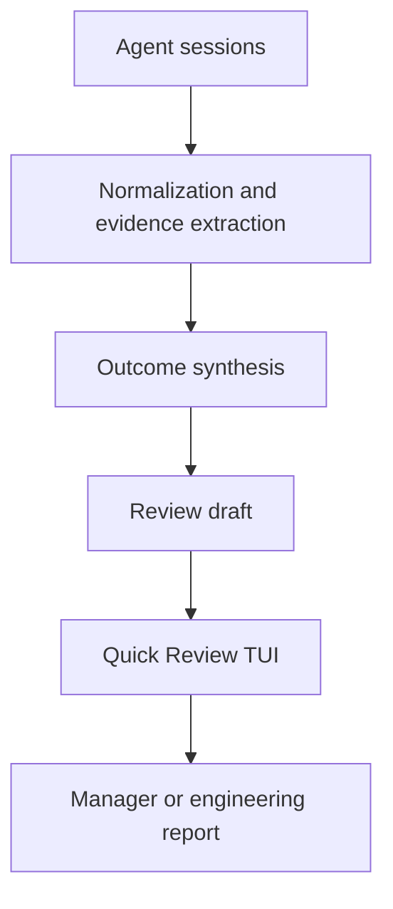

# Evidence-first Quick Review Design

**Project:** iiwi
**Date:** 2026-08-10
**Status:** Approved design, pending written-spec review

## 1. Purpose

iiwi currently turns agent sessions into reports, but the result is still closer to a complete engineering log than a ready-to-share manager update. This feature changes the primary review unit from a session to an outcome and adds a 30–60 second confirmation flow before the final report is generated.

The goal is to let a user answer, with evidence:

- What meaningful outcomes were delivered this week?
- What impact did they have?
- What remains in progress or blocked?
- What matters next week?

The product principle is:

> Turn agent activity into a trustworthy, ready-to-share work update.

## 2. Success Criteria

The first version succeeds when a typical user can:

1. Start from normalized agent sessions.
2. Review up to five preselected outcomes, normally 3–5 when enough valid candidates exist, in 30–60 seconds.
3. Correct, exclude, reorder, or split outcomes without reviewing every session.
4. Add work that has no agent session.
5. Generate a manager or engineering report whose evidence depth follows `Detail`.
6. Return from preview or recover from generation failure without losing in-memory edits.

The feature must preserve compatibility with the existing non-interactive CLI and `--detail brief|full` behavior.

## 3. Product Boundaries

Three controls have distinct responsibilities:

| Control | Responsibility |
|---|---|
| `Report type` | Selects the intended reader, sections, and tone: Manager or Engineering |
| `Detail` | Controls the depth of engineering evidence: Brief or Full |
| Quick Review | Corrects the content of this reporting period: selection, wording, order, blockers, and next steps |

`Report type` should be selected when generating a report and remember the most recent choice through the existing configuration mechanism. This preference is not part of review-draft persistence. `Detail` remains an advanced setting. Quick Review must not introduce a second evidence-depth toggle.

Manager reports use Brief evidence by default. Engineering reports use Full evidence by default. An explicit user choice overrides the default.

Both narrative and structured rendering must honor `Detail`. The current behavior in which narrative rendering can bypass `Detail` is considered part of this feature's implementation scope.

## 4. Architecture and Data Flow

### 4.1 Normalization and evidence extraction

Existing harness ingestion and normalization remain the source of truth. This layer supplies sessions and available references such as repositories, commits, and files. It does not decide final report wording.

### 4.2 Outcome synthesis

Outcome synthesis converts session-level activity into outcome candidates. It must:

- Merge related work across sessions.
- Deduplicate attempts, fixes, and verification belonging to the same result.
- Merge across repositories only when confidence is high.
- Keep low-confidence cross-repository candidates separate.
- Preserve repository-aware evidence even when candidates are merged.
- Rank and preselect 3–5 primary outcomes.
- Retain all remaining candidates in `More candidates`.
- Leave Impact empty when available evidence does not support a reliable statement.

Outcome grouping is outcome-first, with repositories treated as evidence boundaries rather than report boundaries.

Cross-repository auto-merge uses an explicit confidence contract. A synthesis result must be marked `high` and supported by either an explicit shared work identifier or at least two independent linkage signals, such as matching branch/issue context plus direct session references to the same feature. Similar wording or close timestamps alone are never sufficient. Results marked `medium` or `low`, or lacking the required linkage evidence, remain separate. Test fixtures define the expected classification for representative cases so this rule is deterministic at the service boundary even if the internal synthesis method changes.

### 4.3 Review draft

The review draft is the mutable, in-memory state used by the TUI and preview generator. It contains:

- Candidate outcomes and their stable identifiers.
- Title, status, Impact, inclusion state, and display order.
- Whether an item is primary, in `More candidates`, ungrouped, or user-added.
- Evidence references to sessions, repositories, commits, and files.
- Blockers and next-week content.
- Report type and detail selections.

The draft must survive navigation between review and preview and all recoverable generation errors within the same process. Cross-process persistence is not included in version one.

### 4.4 Report generation

Report generation consumes the reviewed draft rather than rebuilding outcomes from raw sessions. It omits empty optional sections and follows the selected report type and detail level.

The Manager report uses concise outcome-and-impact language. The Engineering report may include more implementation context. Brief and Full change evidence depth, not which facts are considered true.

## 5. Outcome Model

An outcome needs enough structure to support synthesis, editing, splitting, rendering, and traceability. The conceptual model is:

| Field | Meaning |
|---|---|
| `id` | Stable identifier within the review draft |
| `title` | Concise description of the result |
| `status` | `completed` or `in_progress` |
| `impact` | Evidence-backed effect; may be empty |
| `included` | Whether it appears in the final report |
| `rank` | User-visible order |
| `origin` | `synthesized` or `user_added` |
| `bucket` | `primary`, `more`, or `ungrouped` |
| `evidence_refs` | Session, repository, commit, and file references |
| `source_group` | Information required to split an automatically merged outcome |

User-added outcomes are clearly labeled `User added`. Evidence is optional for them, and the system must not invent evidence when none is attached.

## 6. Single-screen TUI Interaction

“Single page” means one TUI screen state with a fixed header and help area plus a scrollable content viewport. It does not mean printing every outcome at once.

### 6.1 Layout

The screen contains:

1. Date range and progress indicator.
2. A collapsed settings summary showing Report type and Detail.
3. Primary outcomes, with only the focused outcome expanded.
4. A collapsed `More candidates` group.
5. Optional Blockers and Next week fields.
6. Preview action and keyboard help.

An unfocused outcome is a single-line summary. The focused outcome expands to show status, Impact, and an evidence summary. Evidence details expand only on request.

### 6.2 Keyboard behavior

| Key | Action |
|---|---|
| `Up` / `Down` | Move focus |
| `Space` | Include or exclude the focused outcome |
| `e` | Edit title, status, or Impact |
| `J` / `K` | Move the focused outcome down or up |
| `v` | Expand or collapse evidence |
| `s` | Split an incorrectly auto-merged outcome |
| `a` | Add a user-authored outcome |
| `Enter` | Activate the focused control or open a collapsed section |
| `p` | Generate preview |
| `b` | Return to the previous screen |

Version one does not support manual merging. Low-confidence candidates remain separate, while erroneous automatic merges can be split.

### 6.3 Manual input

Automatic content remains the default. Manual input is optional and appears only after an explicit action:

- `e` corrects a synthesized outcome.
- `a` adds non-agent work such as meetings, design decisions, manual reviews, or coordination.
- Blockers and Next week can be edited, skipped, or explicitly set to `None`.

No large text box is permanently displayed. If generated content is already correct, the user can proceed directly to preview.

### 6.4 Viewport requirements

Viewport calculations must use rendered display lines, not the number of logical rows. Long content must use truncation or ellipsis where expansion is not explicitly requested.

At terminal heights of 20–30 lines, the UI must keep these visible:

- Screen identity and date range.
- Current focused item.
- Relevant keyboard help or action hints.

When height is constrained, expanded Impact and evidence content shrink before those fixed elements disappear.

## 7. Candidate Selection and Editing Rules

- Synthesis preselects up to five important outcomes, normally 3–5 when at least three valid candidates exist.
- It never discards lower-ranked outcomes solely because they fall outside the limit.
- `More candidates` retains lower-ranked candidates in a collapsed section.
- Excluding a primary outcome does not automatically delete it.
- A user can include a candidate from `More candidates` and reorder it among primary outcomes.
- Splitting recreates separate candidates from the merged outcome's source groups and preserves their evidence references.
- User edits take precedence over regenerated prose during the same review flow.
- The 3–5 target is a default, not a validation barrier: users may finish with fewer outcomes or deliberately include more.

## 8. Error Handling and Degradation

### 8.1 Partial synthesis failure

If one or more sessions cannot be synthesized, iiwi places their recoverable information in `Ungrouped candidates`. Successful outcomes remain available and the review continues.

### 8.2 Complete synthesis failure

If no outcomes can be synthesized, the user can retry or fall back to the existing session-based report. The fallback must be explicit and must not be presented as outcome synthesis.

### 8.3 Unsupported Impact

When evidence does not support an Impact statement, the field remains empty and the UI invites optional user input. iiwi must not convert an implementation detail into a claimed business or team impact without support.

### 8.4 Preview failure

If preview generation fails, the review draft remains intact. Returning to Quick Review restores inclusion choices, order, edits, manually added outcomes, Blockers, and Next week.

### 8.5 Constrained terminal

If the viewport is too small for expanded content, iiwi truncates or collapses secondary detail and shows a clear continuation indicator. It must not push the current choice or available actions off-screen.

## 9. Testing Strategy

### 9.1 Unit tests

- Outcome grouping across sessions.
- High-confidence cross-repository merging.
- Low-confidence cross-repository separation.
- Ranking and up-to-five item preselection, including fewer-than-three candidates.
- Preservation of lower-ranked candidates.
- Split reconstruction and evidence preservation.
- Review-draft mutations for include, exclude, reorder, edit, and add.
- Manager/Engineering and Brief/Full rendering combinations.
- Narrative and structured renderers honoring Detail.

### 9.2 Controller and renderer tests

- Focus movement and all documented keys.
- Expanded versus collapsed outcome rendering.
- `More candidates`, `Ungrouped candidates`, and `User added` labels.
- Preview round-trip without state loss.
- Rendered-line viewport calculation at 20, 24, and 30 lines.
- Long title, Impact, path, commit, and error-detail truncation.
- Focus and keyboard help remaining visible.

### 9.3 Failure-path tests

- One-session synthesis failure.
- Complete synthesis failure, retry, and session-report fallback.
- Empty Impact caused by insufficient evidence.
- Preview failure followed by successful retry.
- Terminal resize while an outcome or evidence is expanded.

### 9.4 Compatibility tests

- Existing non-interactive CLI behavior.
- Existing `--detail brief|full` option.
- Existing session-based report fallback.
- Current interactive flows outside Quick Review.

## 10. Version-one Scope

Included:

- Outcome synthesis and evidence references.
- High-confidence automatic cross-repository grouping.
- Primary and additional candidate buckets.
- Single-screen Quick Review TUI.
- Editing, inclusion, ordering, splitting, and user-added outcomes.
- Optional Blockers and Next week.
- Manager and Engineering report types.
- Consistent Detail behavior across narrative and structured reports.
- In-process draft preservation and graceful degradation.

Explicitly excluded:

- Draft persistence across separate executions.
- Manual outcome merging.
- Learning style from historical reports.
- Multi-user collaborative review.
- Automatic publishing to Slack, email, or other platforms.

## 11. Acceptance Criteria

The implementation is accepted when all of the following are true:

1. Related sessions can produce one traceable outcome, including a high-confidence cross-repository case.
2. Low-confidence cross-repository work stays separate.
3. The UI preselects up to five outcomes, normally 3–5 when enough candidates exist, and retains every additional candidate.
4. Users can include, exclude, edit, reorder, split, and add outcomes using the documented interactions.
5. Users can optionally supply Blockers and Next week or skip them.
6. Preview uses the reviewed draft and returning from preview preserves all changes.
7. Partial and complete synthesis failures follow the defined degradation paths.
8. Unsupported Impact is left empty rather than invented.
9. Manager/Engineering and Brief/Full combinations render correctly.
10. Narrative and structured output both honor Detail.
11. At 20–30 terminal lines, the focused item and applicable action help remain visible with long content.
12. Existing non-interactive report generation and `--detail` usage remain compatible.

## 12. Implementation Sequencing Guidance

The later implementation plan should keep the work isolated in this order:

1. Define the outcome and review-draft models.
2. Add outcome synthesis behind a clear service interface.
3. Make both render paths honor Report type and Detail.
4. Add review-state mutations independent of terminal rendering.
5. Add the Quick Review controller state and renderer.
6. Add failure degradation and session-report fallback.
7. Complete viewport, integration, and compatibility verification.

This sequence is guidance for planning, not authorization to begin implementation.
